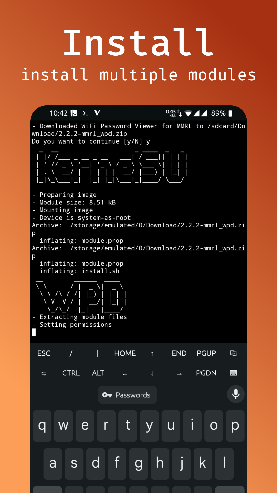

# Magisk Module Repo Loader CLI

MMRL comes now as command line interface, with multi module install support!


<a href="https://mmrl.dergoogler.com/?module=mmrl"></a>

## Repositoreis

You can use any repo you want, the only requirement it that the repo supports the [MRepo-Format](https://github.com/ya0211/magisk-modules-repo-util)

```shell
mmrl repo add "https://apt.izzysoft.de/magisk/json/modules.json" "https://..." # ...
```

Install a module with it

```shell
# Install aliases are "add" and "get"
mmrl install app-data-file-exec data_isolation_support
```

## Get informations

The MMRL CLI also supports getting infos of the module

just run

```shell
mmrl info mkshrc node_on_android
```

## Searching

Wanna search some module? You can do it.

```shell
mmrl search id node # mmrl lookup all "hide user"
```

Get all filter

```shell
mmrl search
```

## Downloading

Downloading just the module is also posible

```shell
mmrl download mkshrc node_on_android # --version 152
```

## Installing modules

Maybe simple...

```shell
mmrl install mkshrc@1.3.4 node_on_android
```

## Install Viper4Android

> Requires version `0.1.1`

```shell
mmrl install -y "https://zackptg5.com/downloads/Audio-Modification-Library_v5.1.zip" "https://john-fawkes.com/Downloads/acp.zip" "https://github.com/AndroidAudioMods/ViPER4Android/releases/download/v0.5.0/V4A_Magisk_Module_0.5.0.zip"
```

# Screenshots

<p>
  
  
  
  
</p>


# Dev

## Error code

```properties

M_INS_SUCCESS = 0
M_INS_FAILURE = 1
M_DWL_FAILURE = 2
FILE_CRA_ERRO = 3
TERM_INTR_ERR = 500
```
